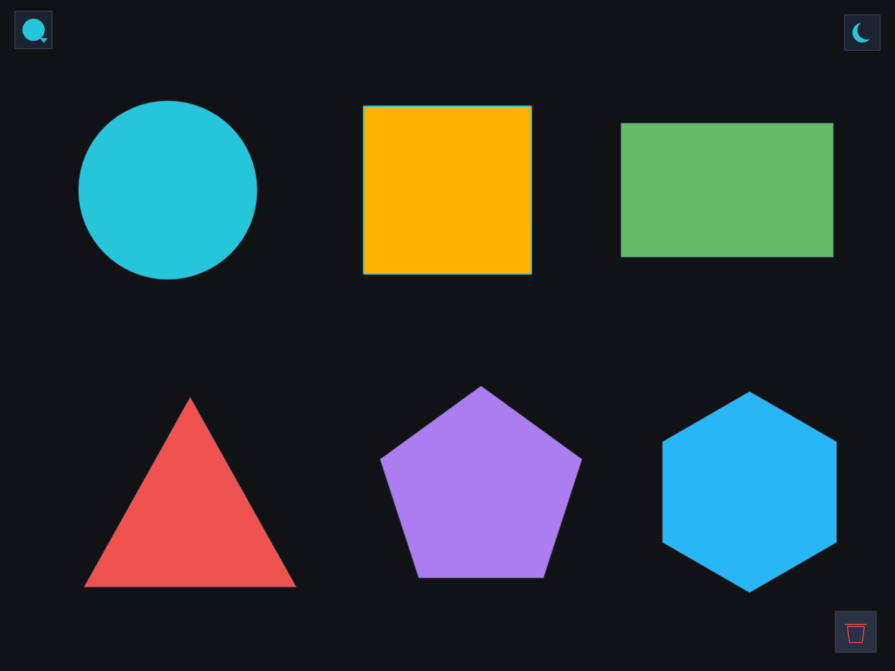
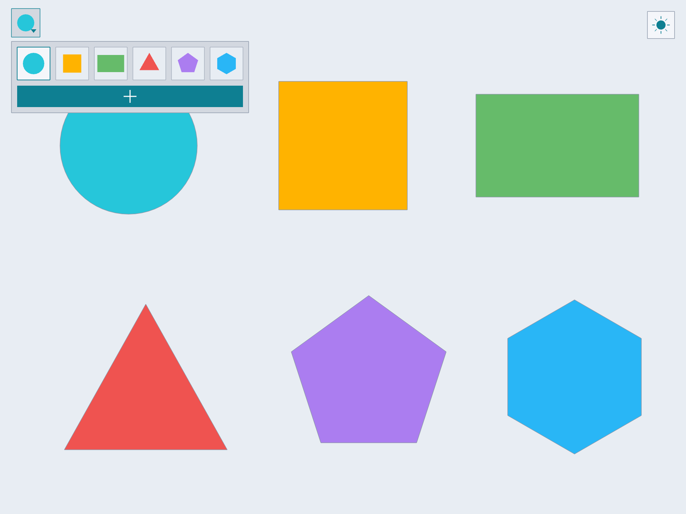

# openGl_figures

Пример на C++ и OpenGL: вывод 2D геометрических фигур (круг, квадрат,
прямоугольник, треугольник, правильные многоугольники). Демонстрирует ООП,
библиотека Qt не используется.



## Возможности

- Тема Dark/Light — кнопка-попап (луна/солнце) справа вверху.
- Наведение и выделение фигуры мышью; выделенная обводится акцентом.
- Перемещение: Shift + перетаскивание выделенной фигуры.
- Инвентарь слева вверху: выбрать фигуру и добавить её кнопкой плюс.
- Удаление: корзина справа внизу (видна при выделении).



## Что демонстрируется

- Абстрактный базовый класс `Shape`, наследники `Circle`, `Rectangle`,
  `Triangle`, `RegularPolygon`; квадрат это `Rectangle::square` (без отдельного класса).
- Полиморфный контейнер `Scene` (`vector<unique_ptr<Shape>>`).
- Паттерн Мост: `ICanvas` отделяет геометрию от OpenGL.
- Идиома PIMPL: `Window` прячет GLFW/OpenGL в `.cpp`.

## Структура

```
src/
  geometry/  Point2D, Color, Shape(+наследники), ShapeFactory
  scene/     Scene, Palette (темы Dark/Light)
  render/    ICanvas, OpenGLCanvas, Window (PIMPL)
  ui/        ThemeButton, Toolbar, IconButton
  app/       main.cpp
tests/       shape_tests.cpp (GoogleTest)
```

Цели CMake: `fig_core` (geometry + scene, без OpenGL) и `fig_view` (render).

## Сборка и запуск

Нужны CMake >= 3.24 и компилятор C++17. GLFW и GoogleTest берутся из системы
(Homebrew / apt / vcpkg) или скачиваются через FetchContent.

```bash
cmake --preset mac-release        # или linux-release / windows-release
cmake --build --preset mac-release
ctest --preset mac-release

./build/mac-release/figures            # окно с фигурами
./build/mac-release/figures --headless # текстовый отчёт (площадь/периметр)
```

## Управление

| Действие | Как |
| --- | --- |
| Выделить / навести | клик / курсор по фигуре |
| Переместить | Shift + перетаскивание выделенной фигуры |
| Добавить | панель слева вверху → выбрать фигуру → плюс |
| Удалить | корзина справа внизу |
| Сменить тему | кнопка луна/солнце справа вверху |
| Выход | Esc или закрытие окна |
